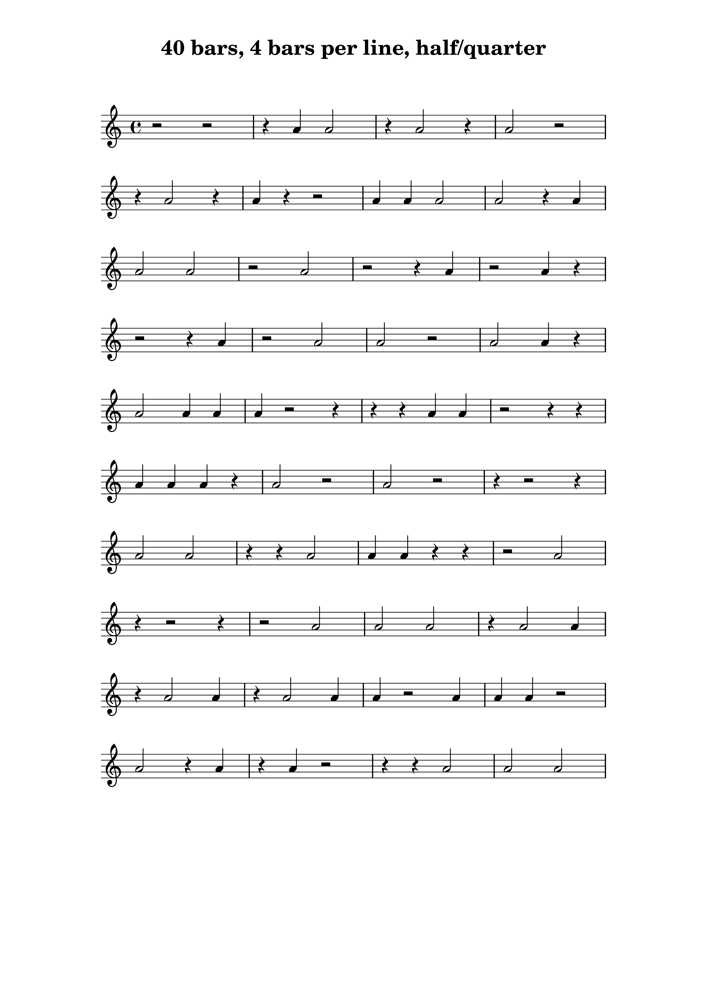

# drumpatterngenerator

Random-generates drum patterns to be used for practicing.
You need to use the Lilypond application to convert the generated drum patterns into PDFs or PNGs and MIDI files.

## Introduction

You can use such generated patterns to practice both your drumming precision and your real-time music score reading skills at the same time.

Each generator run creates one text file which describes a music sheet using the Lilypond DSL. The music sheet describes the drum pattern which the generator has randomly created.
You can influence which concrete note and rest lengths the generator should use.

Once you have generated such a text file, you can use the Lilypond application to create both a PNG (or PDF) and a corresponding MIDI file at the same time.
The PNG (or PDF) could look like this:


Equipped with both files you can then print the PNG and in addition load the MIDI file to a MIDI player of your liking. Then you can use the MIDI player to play the drum pattern while you would read the music notes and try to follow along with playing the pattern at the same time.


## How to prepare

Before you can start generating, you need to install some applications.
Luckily, all these applications are available for free on Linux, MacOS, and Windows. 

1. Install a JDK (Java Development Kit) version 8 or higher.
2. Install Maven (a build tool for Java applications) version 3 or higher.
3. Install Lilypond version 2.24.1.
4. Compile the drumpatterngenerator with `mvn package`. This will generate a `target` subfolder, and there you will find the file `drumpatterngenerator-1.0.0.jar`.

## How to start generating

1. Start the generator with `java -jar drumpatterngenerator-1.0.0.jar -o myfirstpattern.ly`. If this was successful, the file "myfirstpattern.ly" has been created in your work folder.
2. The generator created some output messages, and the very last one already tells you how to use Lilypond to create the PNG (or PDF) and MIDI file.

## Example

To create
- a 16bar drum pattern sheet
- with 4 bars per line
- which only uses whole, half, quarter, and eight notes or rests
- and has the title "My First Drum Pattern"
- and is stored in the file `myfirstpattern.ly`

use the following command line (with everything written in one line - the line feeds shown below are only there for a better readability and understanding);
```
java -jar drumpatterngenerator-1.0.0.jar
    -b 16
    -l 4
    -d 1,2,4,8                      
    -t "My First Drum Pattern"
    -o myfirstpattern.ly
```

For more examples incl. generated PNG and MIDI files please check the `examples` subfolder.

### Generator run with default settings

To create the `drumpattern_default-settings` file as it is stored in the `examples` subfolder use the following command:
```
java -jar drumpatterngenerator-1.0.0.jar
    -o drumpattern_default-settings.ly
```

### Generator run with all available parameters explicitly chosen

To create the `drumpattern_9-bars_3-bars-per-line_whole-half-quarter` file as it is stored in the `examples` subfolder use the following command:
```
java -jar drumpatterngenerator-1.0.0.jar
    -b 9
    -l 3
    -d 1,2,4                      
    -t "9 bars, 3 bars per line, whole/half/quarter"
    -o drumpattern_9-bars_3-bars-per-line_whole-half-quarter.ly
```

And if these command line options are too cryptic for you, you can also use the options with their long name - not sure if this becomes easier, though :-)
```
java -jar drumpatterngenerator-1.0.0.jar
    --numberOfBars 9
    --numberOfBarsPerLine 3
    --durationDenominators 1,2,4                      
    --title "9 bars, 3 bars per line, whole/half/quarter"
    --output drumpattern_9-bars_3-bars-per-line_whole-half-quarter.ly
```

## Bonus material: Audio files

As you maybe do not have a full-blown MIDI player at hands, I have manually rendered audio files in the MP3 format out of all the examples shown above.
All audio files have a speed of 120 bpm.
You will find these MP3 files next to all the other files in the `examples` subfolder.

Compared to the original MIDI files these MP3 files offer certain convenience features:
- They sound on their own :), meaning that you can play them on any device with just its standard media player application.
- They contain a click track along with the actual drum play to help you stay in time.
- They contain a two-bar count-in phase in which you only hear the click track. This count-in gives you time to get prepared.

Keep in mind that neither this drumpatterngenerator nor Lilypond are able to create such MP3 files.

I have used Ableton Live to import the MIDI files, add the drum sounds and the count-in, and then finally rendered the MP3 files.
In case you also have Ableton Live at hands you can use my project if you want to add more examples. See the `examples-as-audio-files Project` subfolder. I have used the "707 Core Kit" from the core library as the drum machine to produce the snare and the metronome click sound.
